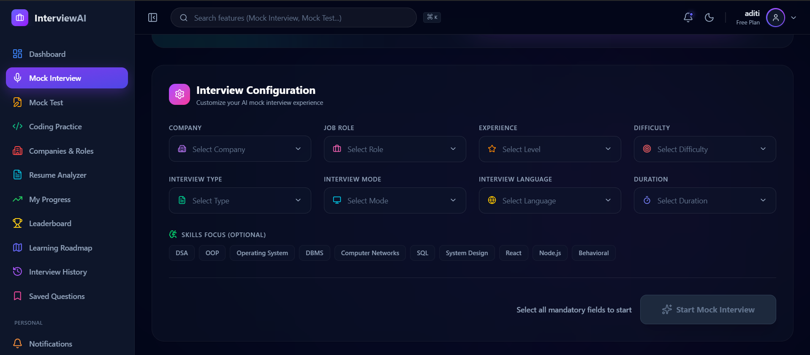
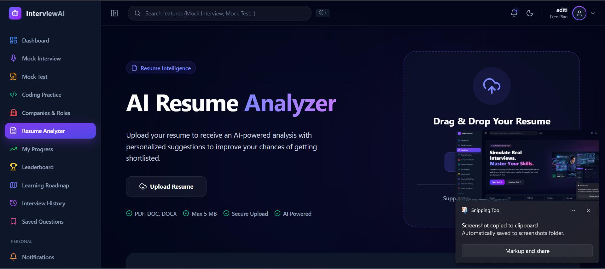
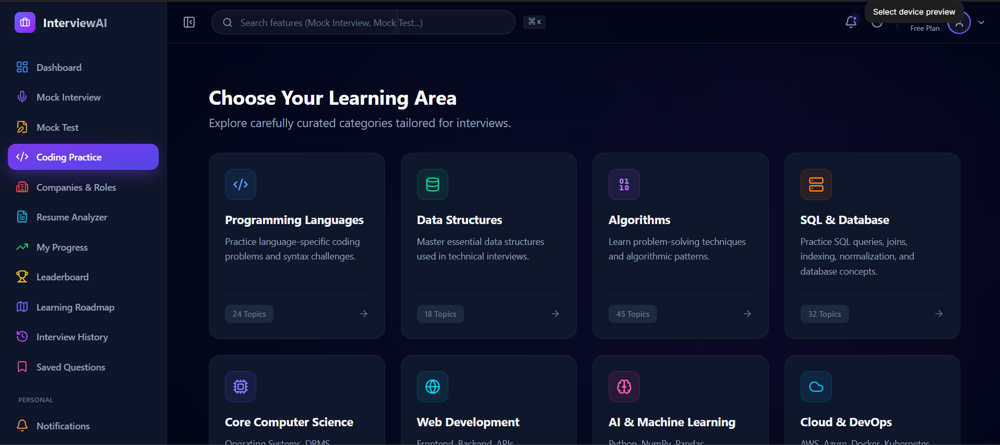
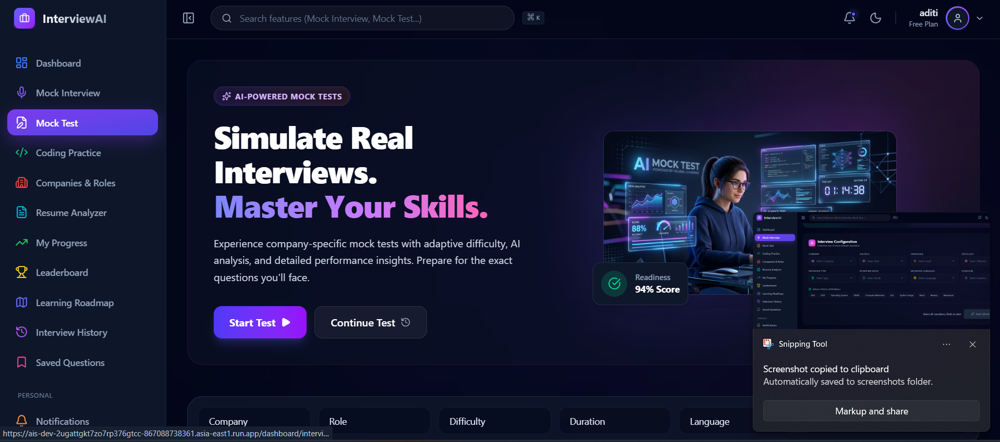
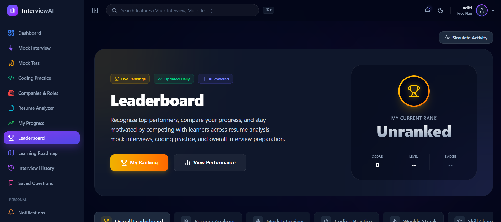
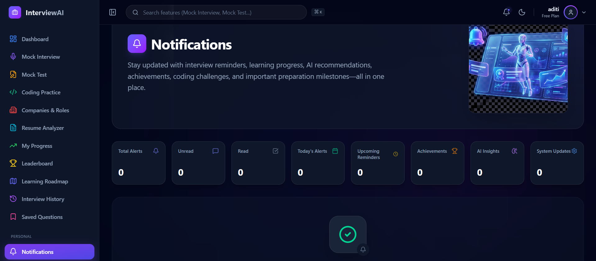
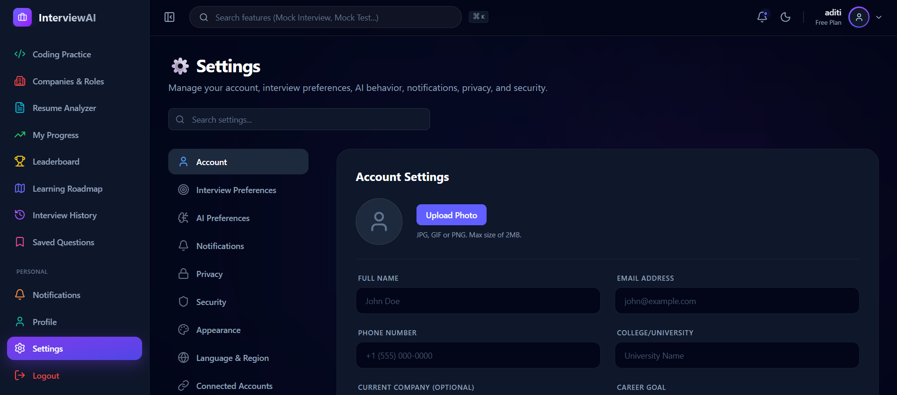

# 🤖 InterviewAI – AI Interview Preparation Platform

An AI-powered interview preparation platform designed to help students and job seekers prepare for technical and HR interviews through intelligent mock interviews, coding practice, resume analysis, personalized learning roadmaps, and progress tracking.

---

## 📌 Project Overview

InterviewAI is a smart interview preparation platform that provides company-specific interview preparation using Artificial Intelligence. Users can practice interviews, improve coding skills, analyze resumes, monitor progress, and receive personalized learning recommendations.

---

## 🖼️ Homepage


---

## ✨ Features

- 🎤 AI Mock Interview
- 💻 Coding Practice
- 📄 AI Resume Analyzer
- 🏢 Company & Role Preparation
- 📝 Mock Test
- 📈 Progress Tracking
- 🏆 Leaderboard
- 🧠 Personalized Learning Roadmap
- 🔔 Notifications
- 👤 User Profile
- 📚 Saved Questions
- 📜 Interview History
- ⚙️ User Settings

---

## 🛠️ Tech Stack

- React
- TypeScript
- Vite
- HTML5
- CSS3
- JavaScript
- Supabase
- Google Gemini API

---

# 📸 Project Screenshots

## 💻 Dashboard


---

## 🎤 Mock Interview



---

## 📄 Resume Analyzer



---

## 💻 Coding Practice



---

## 📝 Mock Test



---

## 🏢 Company & Role Selection


---

## 🗺️ Learning Roadmap


---

## 📈 My Progress


---

## 🏆 Leaderboard



---

## 📜 Interview History


---

## 📚 Saved Questions


---

## 🔔 Notifications



---

## 👤 My Profile


---

## ⚙️ Settings



---

# 🚀 Installation

Clone the repository:

```bash
git clone https://github.com/aditi18520046-glitch/ai-interview-preparation-platform.git
```

Install dependencies:

```bash
npm install
```

Start the development server:

```bash
npm run dev
```

---

## 📂 Project Structure

```
src/
assets/
images/
public/
```

---

## 🎯 Future Scope

- AI Video Interview
- Voice-based AI Interview
- Multi-language Support
- Company-specific Question Bank
- AI Interview Feedback Reports
- Performance Analytics
- Mobile Application
- Cloud Deployment

---

## 🌐 Live Demo

🚧 Coming Soon

---

## 👩‍💻 Developer

**Aditi Singh**

B.Tech (Computer Science & Engineering)

Institute of Technology and Management, GIDA, Gorakhpur

---

## ⭐ Support

If you like this project, consider giving it a ⭐ on GitHub.
